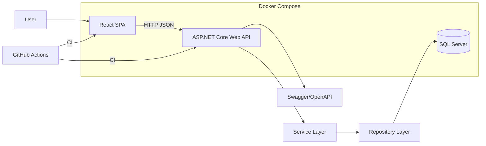
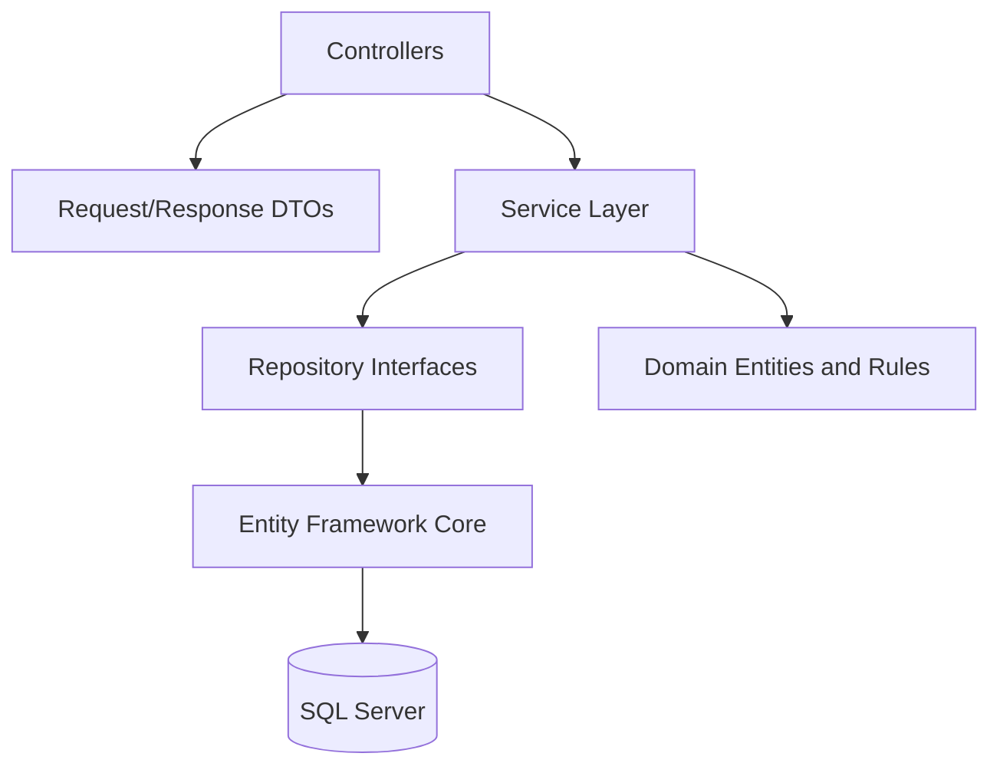
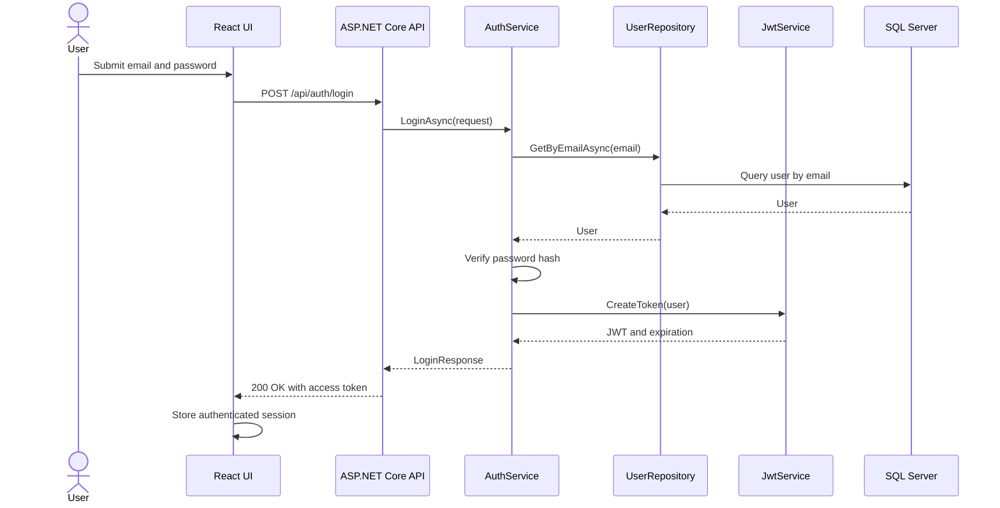
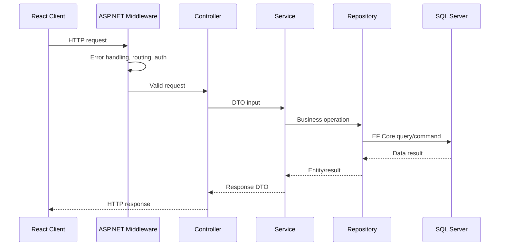
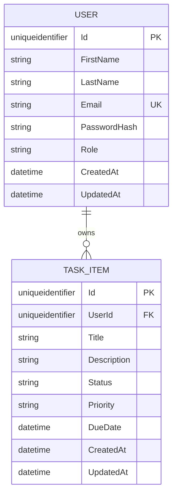
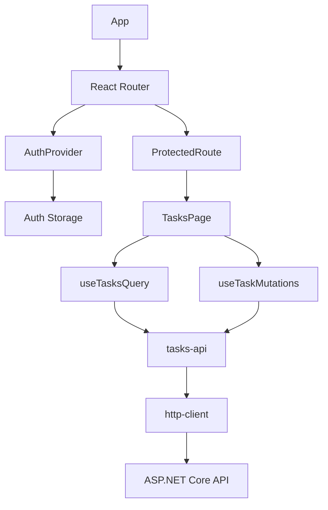
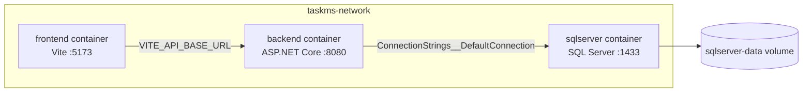
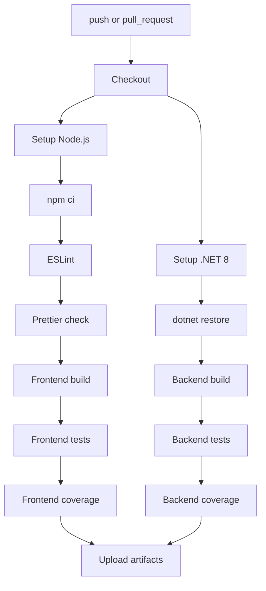

# Architecture

This document describes the main architectural decisions behind Task Management System.

## System Overview



The application is split into a React frontend, an ASP.NET Core backend, and a SQL Server database. Docker Compose provides the local runtime environment, while GitHub Actions validates the project automatically on every push and pull request.

## Frontend Architecture

The frontend is organized by feature.

```text
src/frontend/src/
  features/
    auth/
    tasks/
  components/
  layouts/
  pages/
  hooks/
  services/
  types/
  utils/
```

The main goal is to keep user-facing workflows close to their components, hooks, API functions, and types.

Responsibilities:

- Pages coordinate full screens.
- Components render reusable UI.
- Hooks contain stateful behavior.
- API modules isolate HTTP calls.
- Types keep request and response contracts explicit.
- Tests cover user-visible behavior and important state transitions.

## Backend Architecture

The backend follows a layered design.



### Repository Pattern

Repositories isolate persistence details from business logic.

Benefits:

- Controllers and services do not depend directly on Entity Framework queries.
- Data access can evolve without changing HTTP contracts.
- Integration tests can focus on behavior rather than query implementation.
- Ownership rules and query boundaries remain explicit.

Current repository responsibilities include:

- User lookup and persistence.
- Task lookup, creation, update, and deletion.
- User-scoped task access.

### Service Layer

The service layer contains application business rules.

Examples:

- Registering a user.
- Validating duplicate emails.
- Hashing passwords.
- Authenticating credentials.
- Generating JWT access tokens.
- Enforcing task ownership.
- Mapping entities to DTO responses.

Controllers should remain thin. They receive HTTP requests, delegate work to services, and return HTTP responses.

## Authentication Flow



Authenticated requests include:

```text
Authorization: Bearer <access-token>
```

The backend validates issuer, audience, lifetime, and signing key before allowing protected endpoints.

## Request Lifecycle



Validation happens at the API boundary through data annotations and custom validators. Unexpected errors are normalized by exception handling middleware.

## Database Design



Design notes:

- `User.Email` has a unique constraint.
- `TaskItem.UserId` links tasks to their owner.
- Task endpoints must only return or mutate tasks owned by the authenticated user.
- Passwords are stored as hashes, never as plaintext.
- EF Core migrations define the database schema.

## Component Relationships



## Docker Architecture



Docker Compose responsibilities:

- Build the frontend and backend images.
- Start SQL Server with a persistent volume.
- Inject runtime configuration through environment variables.
- Run health checks before dependent services start.
- Expose local ports for browser and API access.

## CI/CD Architecture



The workflow is intentionally strict: lint, formatting, builds, tests, and coverage generation must pass before artifacts are published.

## Security Considerations

- JWT settings are configurable and should be provided through environment variables outside development.
- The committed base `appsettings.json` does not contain usable production secrets.
- Passwords are hashed before persistence.
- Controllers never return password hashes.
- Logs must never include passwords, JWTs, or secrets.
- User task access is scoped by authenticated user ownership.
